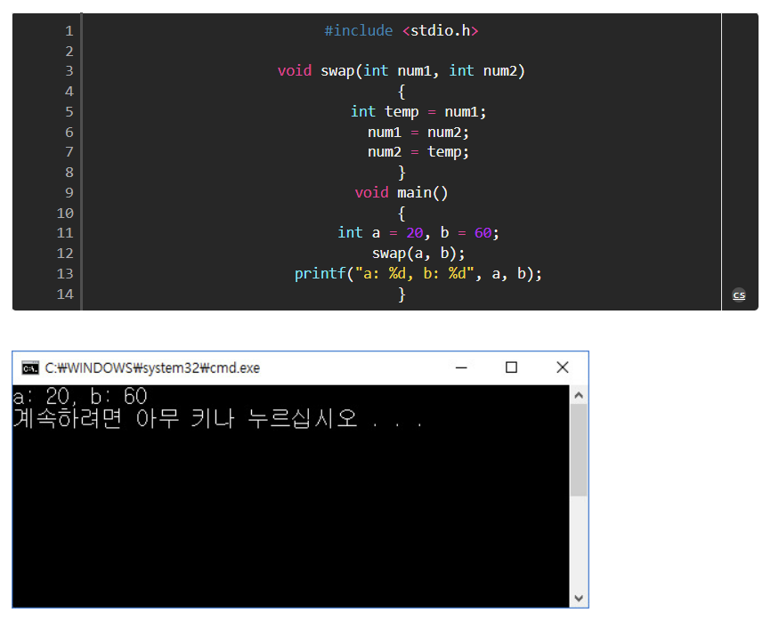
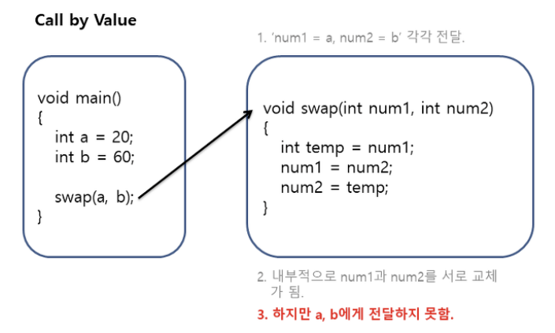
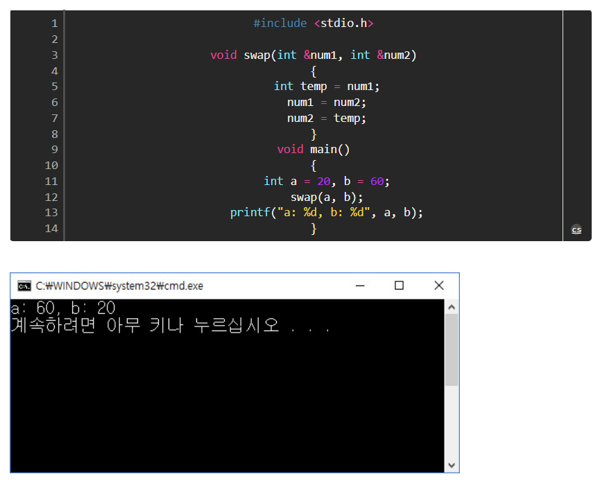
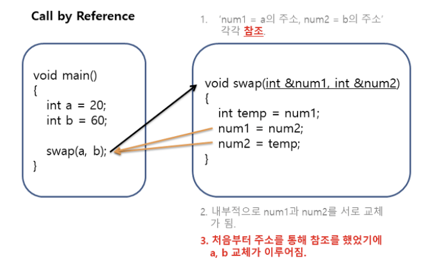

# Call by Value vs Call by Reference

## Call by Value(값에 의한 호출)

값에 의한 호출로 인자로 받은 값을 복사하여 처리함

 

- 장점: 복사하여 처리하기 때문에 안전함. 원래의 값이 보존이 됨.
- 단점: 복사를 하기 때문에 메모리가 사용량이 늘어남.

 

- 값만 받아와서 내부적으로 처리를 하고 아무 것도 넘기지를 않음

 

## Call by Reference(참조에 의한 호출)

인자로 받은 값의 주소를 참조하여 직접 값에 영향을 줌

 

- 장점: 복사하지 않고 직접 참조를 하기에 빠름.
- 단점: 직접 참조를 하기에 원래 값이 영향을 받음.(리스크)

 

- 직접 주소를 가져와서 처리를 했기 때문에 swap()의 내부 처리로도 a,b가 교체 됨.
- 주소나 포인터를 사용하면 직접 변수에 접근하기 때문에 리스크가 있음

 

---

## 예상 질문

📌Call by Reference와 Call by Value의 차이점

 

---

## 🔗 Reference

- https://codingplus.tistory.com/29
