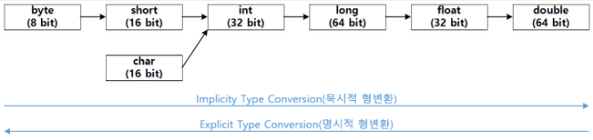
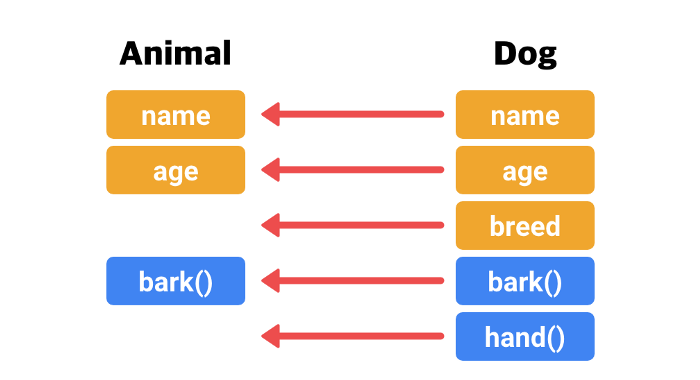
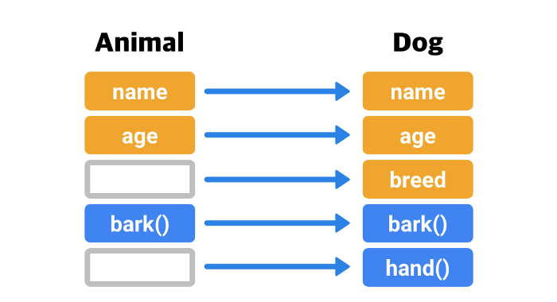

# **Casting**

## **Casting이란?**

---

<br>

> Casting이란 변수나 리터럴 타입을 다른 타입으로 변환하는 것을 의미한다. 형변환이라고 부르기도 하며, 객체지향의 다향성에 있어 중요한 개념이다.

<br>

## **기본형 Casting**

---

<br>

기본형(primitive type)인 boolean, short, int, long float, double, char의 Casting은 데이터의 손실을 막기 위해 동작한다.

```
int a = 1.234; // 에러<br>
int b = (int) 1.234; // 성공
```

<br>

첫 번째줄에서 에러가 발생하는 이유는 int형에 1.234를 넣으려고 할때 0.234라는 데이터의 손실이 발생하기 때문이다.

<br>



### **묵시적 형변환**

---

<br>

작은 타입에서 큰 타입으로 변환해야할 때 따로 명시하지 않아도 프로그램 실행 도중 자동으로 일어나는 형태이다.

```
byte a = 100;
int b = a;  // 성공
```

<br>

### **명시적 형변환**

---

<br>

큰 타입에서 작은 타입으로 변환하고 싶을 떄, 데이터의 손실을 감수하더라도 강제로 변환시키는 형태이다.

```
double a = 1.234;
int b = (int) a;
```

위의 경우 a를 int형으로 변환해 b에 넣을 경우 소수점 아래부분이 손실되지만 변수 앞에 명시해줌으로써 형변환이 가능하다.

<br>

## **참조형 Casting**

---

<br>

참조형 타입에서는 서로 상속이나 구현 관계 등에 있는 객체끼리만 Casting이 가능하다.

<br>

```
class Animal {
  String name;
  int age;

  void bark() {
    System.out.println("동물이 짖는 소리");
  }
}
class Dog extends Animal {
  String breed;

  @Override
  void bark() {
    System.out.println("왈왈");
  }
  void giveHand() {
    System.out.println("손");
  }
}
```

### **Upcasting**

---

<br>

Upcasting이란 자식 클래스에서 부모 클래스로 Casting되는것을 의미한다. 기본적으로 하위 클래스에서 상위 클래스로 변환되기 때문에 묵시적 형변환이 가능하다.



```
Animal animal = new Dog(); // Animal 타입에 Dog타입 대입
animal.bark(); // 왈왈
animal.breed = "보더콜리" // 컴파일 에러
animal.giveHand(); // 컴파일 에러
```

위의 실행결과를 통해 Upcasting된 객체는 자식 객체만 가지고 있는 멤버에는 접근이 불가능함을 알 수 있다.

<br>

### **DownCasting**

---

<br>

DownCasting이란 Upcasting으로 인해 고유의 특성을 잃은 자식 클래스 객체를 다시 원래의 형태로 복원 시켜주는 것을 의미한다. 따라서 Upcasting과는 다르게 명시적 형변환으로 Casting 해야한다.



```
Animal animal = new Dog();
animal.name = "Lulu";

Dog dog = animal; // 컴파일 에러
System.out.println(dog.breed); // 컴파일 에러
```

위의 코드에서 animal은 Dog 객체가 Upcasting되어 현재 Animal 형태로 변환되어 있는 상태인데, 이를 아래의 코드처럼 다시 Dog 형태로 변환해주는 것이 Downcasting이라고 할 수 있다.

```
Dog dog = (Dog)animal; // (캐스팅할 객체타입) 캐스팅할 객체
dog.breed = "보더콜리"; // 가능
```

<br>

## **예상 질문**

---

<br>

📌 묵시적 형변환과 명시적 형변환의 차이점은 무엇인가요?

> 묵시적 형변환은 작은 타입에서 큰 타입으로 변환해야할 때 따로 명시하지 않고 프로그램이 실행 도중 자동으로 일어나는 변환해주는 형변환의 형태인 반면, 명시적 형변환은 큰 타입에서 작은 타입으로 변환하고 싶을 떄 변수 앞에 캐스팅할 형을 직접 명시해서 변환하는 형태입니다.

📌 Upcasting과 Downcasting이 무엇인가요?

> 위 내용 참고

## **참고 자료**

https://medium.com/@plantstoen/%EC%95%8C%EC%95%84%EB%91%90%EB%A9%B4-%EC%93%B8%EB%AA%A8%EC%9E%88%EB%8A%94-%EC%9E%90%EB%B0%94%EC%9D%98-%ED%97%B7%EA%B0%88%EB%A6%AC%EB%8A%94-%EC%A0%90-1-26b1e1a35491
