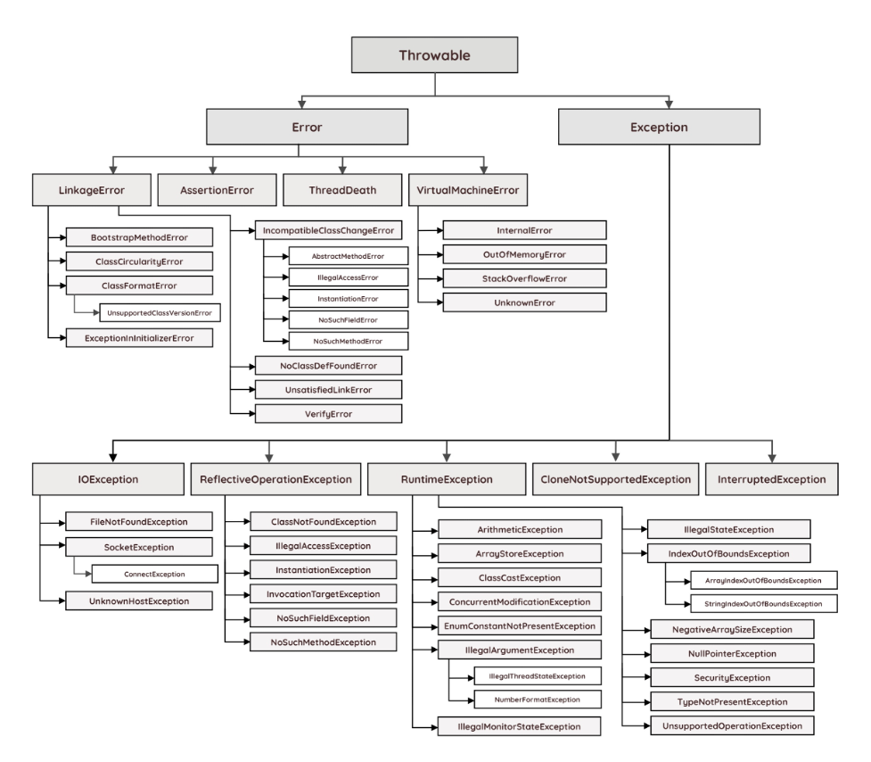

# **Error & Exception**

<br>



<br>

Java의 최상위 클래스인 Object 클래스에는 Throwable 클래스가 존재하고, 이 Throwable 클래스 하위에 Error와 Exception클래스, 그리고 printStackTrace() 등의 메서드가 존재한다.

<br>

## **Error란?**

---

<br>

Error(에러)란 프로그램 실행중 어떤 원인에 의해 오작동하거나 비정상 종료된 경우 이를 초래하는 원인을 의미한다. 에러는 JVM 실행에 문제가 생겼다는 것이므로, 프로그램은 실행 불능이 된다. 개발자는 이런 에러에 대처할 방법이 없다.

<br>

## **Exception이란?**

---

<br>

Exception(예외)란 사용자의 잘못된 조작 또는 개발자의 잘못된 코딩으로 인해 발생하는 오류로, 개발자가 미리 예측하거나 예외 발생 시 코드로 수습할 수 있다.

- **Checked Exception** : 예외처리를 하지 않으면 컴파일이 되지않는 Exception으로, RuntimeException 이외의 모든 예외를 말한다. 주로 JVM 외부와 통신(네트워크, 파일시스템 등)할 때 쓰인다.
  <br>ex) IOException, SQLException ...

- **Unchecked Exception** : 예외처리를 하지 않아도 컴파일이 가능한 Exception으로, RuntimeException 하위의 모든 예외를 말한다.
  <br>ex) NullPointerException, IndexOutOfBoundException ...
  <br>

<br>

### **대표적인 Exception의 종류**

---

<br>

- NullPointerException : Null 레퍼런스를 참조할때 발생, 뭔가 동작시킬 때 발생합니다.
- IndexOutOfBoundsException : 배열과 유사한 자료구조(문자열, 배열, 자료구조)에서 범위를 벗어난 인덱스 - 번호 사용으로 발생합니다.
- FormatException : 문자열, 숫자, 날짜 변환 시 잘못된 데이터(ex. "123A" -> 123 으로 변환 시)로 발생하며, 보통 사용자의 입력, 외부 데이터 로딩, 결과 데이터의 변환 처리에서 자주 발생합니다.
- ArthmeticException : 정수를 0으로 나눌때 발생합니다.
- ClassCastException : 변환할 수 없는 타입으로 객체를 변환할 때 발생합니다.
- IllegalArgumentException : 잘못된 인자 전달 시 발생합니다.
- IOException : 입출력 동작 실패 또는 인터럽트 시 발생합니다.
- IllegalStateException : 객체의 상태가 매소드 호출에는 부적절한 경우에 발생합니다.
- ConcurrentModificationException : 금지된 곳에서 객체를 동시에 수정하는것이 감지될 경우 발생합니다.
- UnsupportedOperationException : 객체가 메소드를 지원하지 않는 경우 발생합니다.

<br>

### **Exception Handling**

---

<br>

Exception Handling(예외 처리)란 JVM이 Exception을 발생 시킬 때, 해당 Exception에 대해 적절한 대처 방안을 실행해 프로그램을 정상적으로 지속시키기 위한 작업을 의미한다.

<br>

**1. try - catch**

```java
try {
    System.out.println(2/0);
} catch(IndexOutOfBoundsException e) {
    System.out.println("IndexOutOfBoundsException");
} catch(Exception e) {
    e.printStackTrace();
}
```

try 부분에 예외가 발생할 수 있는 코드를, catch 부분에 예상되는 예외의 대처 방안을 작성함으로써 프로그램이 중단되는 것을 방지 할 수 있다.

<br>

**2. throw, throws 사용**

```java
class FoolException extends Exception {
}

public class Sample {
    public void sayNick(String nick) throws FoolException {
        if("fool".equals(nick)) {
            throw new FoolException();
        }
        System.out.println("당신의 별명은 "+nick+" 입니다.");
    }

    public static void main(String[] args) {
        Sample sample = new Sample();
        try {
            sample.sayNick("fool");
            sample.sayNick("genious");
        } catch (FoolException e) {
            System.err.println("FoolException이 발생했습니다.");
        }
    }
}
```

<br>

- throws : 메서드를 정의하는 시점에 사용하는 키워드로, Exception이 발생하면 해당 Exception을 상위 클래스에 전달해준다.
- throw : Exception을 사용자가 발생시킬 때 사용하는 키워드이다.

<br>

## **예상 질문**

---

<br>

📌 Error와 Exception의 차이점이 무엇인가요?

> 에러는 개발자가 대처할 방법이 없는 반면 예외는 개발자가 예측이 가능하고, 만일 예외 발생 시 예외처리를 통해 해결할 수 있는 차이점이 있습니다.

📌 예외처리를 위한 방법들은 무엇이 있나요?

> try-catch 구문 활용, throw,throws 키워드를 활용하는 방법이 있습니다.

📌 예외처리 시 사용하는 키워드인 throw와 throws의 차이점이 무엇인가요?

> throws는 메서드를 정의하는 시점에 사용하는 키워드로, 예외가 발생하면 해당 예외를 상위 클래스에 전달해주는 역할을 하고, throw는 사용자가 예외를 발생시킬 때 사용하는 키워드입니다.
