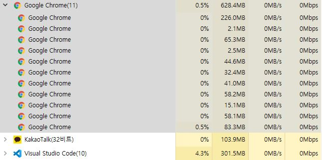

# **Java의 Thread**

<br>

## **Thread란?**

---

<br>



<br>

> Thread란 프로세스 내에서 실제로 작업을 수행하는 주체를 의미한다. 모든 프로세스에는 한 개 이상의 Thread가 존재하여 작업을 수행힌다.

<br>

※ 프로세스 : 사용자가 작성한 프로그램이 운영체제에 의해 메모리 공간을 할당받아 실행 중인 것으로, 실행 중인 프로그램이자 하나의 단위라고 할 수 있다. 프로그램에 사용되는 데이터와 메모리 등의 자원과 Thread로 구성된다.

<br>

## **Thread의 생성**

---

<br>

### **1. Runnable 인터페이스 구현**

```
public class Program {

    public static void main(String[] args) {
        Thread th = new Thread(new RunnableTest());
        th.start();
    }
}

public class RunnableTest implements Runnable {

    @Override
    public void run() {
        for (int i = 1; i <= 100; i++) {
            System.out.printf("쓰레드: %d\n", i);
        }
    }
}
```

Runnable 인터페이스를 구현한 경우는, 해당 클래스를 인스턴스화해서 Thread 생성자에 argument로 넘겨줘야 한다.

그리고 run()을 호출하면 Runnable 인터페이스에서 구현한 run()이 호출되므로 따로 오버라이딩하지 않아도 되는 장점이 있다.

<br>

### **2. Thread 클래스 상속**

```
public class Program {

    public static void main(String[] args) {
        Thread th = new MyThread();
        th.start();
    }
}

public class MyThread extends Thread {
    @Override
    public void run() {
        for (int i = 1; i <= 100; i++) {
            System.out.printf("쓰레드: %d\n", i);
        }
    }
}
```

Runnable 구현의 경우 Thread 클래스의 static 메소드인 currentThread()를 호출하여 현재 Thread에 대한 참조를 얻어와야만 호출이 가능하지만, Thread 클래스를 상속받으면 Thread 클래스의 메소드(getName())를 바로 사용할 수 있다.

<br>

## **Thread의 실행**

---

> **run()메서드가 아닌 start()메서드를 호출함으로써 실행**

<br>

Thread를 이용한다는 것은 JVM이 다수의 콜 스택을 번갈아가며 일을 처리하고있음을 뜻한다. run() 메서드를 직접적으로 실행할 경우 여러개의 콜 스택을 사용하는것이 아닌 main()의 콜 스택에 run() 메서드를 담는 것이므로 , Thread가 작업을 실행하기 위해 필요한 해당 Thread만의 독립적인 콜 스택을 생성하고, Override한 run() 메서드를 스택에 담아주는 메서드인 start()를 호출함으로써 Thread를 실행해야한다.

<br>

## **Thread의 상태 6가지**

---

<br>

- NEW : Thread가 생성되었지만 Thread가 아직 실행할 준비가 되지 않았음
- RUNNABLE : Thread가 실행되고 있거나 실행준비되어 스케줄링을 기달리는 상태
- WAITING : 다른 Thread가 notify(), notifyAll()을 불러주기 기다리고 있는 상태(동기화)
- TIMED_WAITING : Thread가 sleep(n) 호출로 인해 n 밀리초동안 잠을 자고 있는 상태
- BLOCK : Thread가 I/O 작업을 요청하면 자동으로 Thread를 BLOCK 상태로 만든다.
- TERMINATED : Thread가 종료한 상태
  ※ notify() : 일시 정지 상태에 있는 다른 Thread를 실행 대기 상태로 만듬(RUNNABLE)

<br>

## **Thread 동기화 구현법**

---

<br>

### **동기화란?**

<br>

> 공유하는 데이터의 일관성이 유지될 수 있게 Thread의 실행 순서를 정의하고 이 순서를 따르도록 하는 것을 의미한다.

<br>

### **synchronized 키워드 활용**

<br>

```
public synchronized void saveMoney(int save){
    int m = money;
    try{
        Thread.sleep(2000);
    } catch (Exception e){

    }
    money = m + save;
    System.out.println("입금 처리");

}

public synchronized void minusMoney(int minus){
    int m = money;
    try{
        Thread.sleep(3000);
    } catch (Exception e){

    }
    money = m - minus;
    System.out.println("출금 완료");
}
```

현재 데이터를 사용하고 있는 해당 Thread를 제외하고 나머지 Thread들은 데이터에 접근 할 수 없도록 막아주는 개념으로 이해하면 된다.

<br>

### **기타 동기화 개념**

- 임계 영역(critical section) : 공유 자원에 단 하나의 Thread만 접근하도록 (하나의 프로세스에 속한 Thread만 가능)
- 뮤텍스(mutex) : 공유 자원에 단 하나의 Thread만 접근하도록 (서로 다른 프로세스에 속한 Thread도 가능)
- 이벤트(event) : 특정한 사건 발생을 다른 Thread에게 알림
- 세마포어(semaphore) : 한정된 개수의 자원을 여러 Thread가 사용하려고 할 때 접근 제한
- 대기 가능 타이머(waitable timer) : 특정 시간이 되면 대기 중이던 Thread 깨움

<br>

## **예상 질문**

---

<br>

📌 Thread란 무엇인가요?

> Thread란 프로세스 내에서 실제로 작업을 수행하는 주체를 의미합니다.

📌 Thread를 구현할 때 Runnable 인터페이스를 구현하는 것과 Thread 클래스를 상속받아 구현하는 것의 차이점은 무엇인가요?

> 위 내용 참고

📌 Thread의 동기화가 필요한 이유가 무엇인가요?

> Thread가 순서에 상관 없이 공유 자원에 접근할 경우 데이터의 일관성을 헤칠 수 있기 때문에 동기화를 통해 Thread의 실행 순서를 정의해줘야 합니다.
