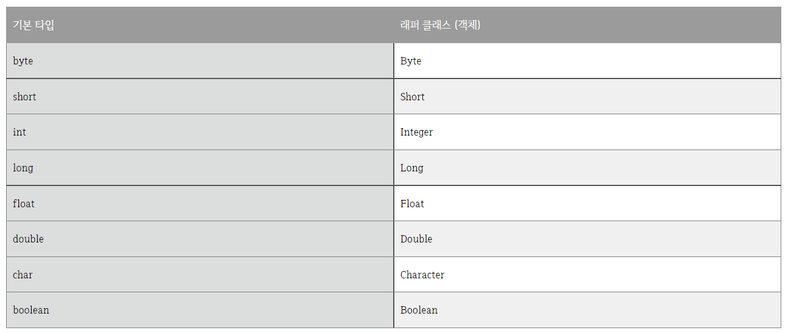

# 오토 박싱과 오토 언박싱

## 래퍼클래스(Wrapper Class)

- 기본타입에 해당하는 데이터를 객체로 포장해주는 클래스를 래퍼클래스
- 인스턴스에 저장된 값을 변경할 수 없으며, 값을 참조하기 위해 새로운 인스턴스를 생성하고 생성된 인스턴스의 값을 참조만 함

<br/>

### 기본타입과 래퍼클래스(객체)



<br/>

## 박싱과 언박싱

박싱

- 기본 타입의 데이터를 래퍼클래스로 변환하는 과정

<br/>

언박싱

- 래퍼클래스에 저장된 값을 기본 타입의 데이터로 변환하는 과정

<br/>

<pre>
int n = 3;

Integer num = new Integer(n); //Boxing

int m = num.intValue(); //UnBoxing
</pre>

<br/>

=> 명시적으로 지정하지 않더라도 자바 컴파일러가 자동으로 박싱/언박싱을 진행.

<br/>

=> 앞에 '오토'를 붙여 **오토 박싱, 오토 언박싱** 이라고 함.

<br/>

## 오토 박싱

- 원시데이터 유형을 래퍼클랙스 객체로 변환
- java.util.Collection유형으로 작업할 때도 유용
- 기본 유형의 컬렉션 생성시, 기본유형의 컬렉션을 직접 생성할 수 없으며 Object의 컬렉션만 생성 가능
  <pre>
  int a = 56;
  Integer i = a; //Auto Boxing
  </pre>

  ```java

  ArrayList<int> al = new ArrayList<int>();    //not supported

  ArrayList<Integer> al = new ArrayList<Integer>(); // supported
  al.add(45); //auto Boxing

  ```

<br/>

## 오토 언박싱

- 래퍼 클래스 객체를 다시 원시 유형으로 변환
- JVM에 의해 자동으로 수행되므로 특정 작업에 래퍼클래스를 사용한 다음 기본형식으로 인해 처리속도가 빨라짐

<pre>
Integer s = 45;
int a = s; //auto UnBoxing;
</pre>

```java

ArrayList<Integer> al = new ArrayList<Integer>();
al.add(45);

int a = al.get(0); // returns the object of Integer. Automatically Unboxed.

```

---

## 예상 질문

📌 오토박싱과 오토언방식이 무엇인가

📌 wrapper 클래스가 무엇인가

<br/>

---

## 🔗 Reference

- https://mozi.tistory.com/573
- http://daplus.net/java-java%EC%97%90%EC%84%9C-%EC%98%A4%ED%86%A0-%EB%B0%95%EC%8B%B1%EA%B3%BC-%EC%96%B8-%EB%B0%95%EC%8B%B1%EC%9D%84-%EC%82%AC%EC%9A%A9%ED%95%98%EB%8A%94-%EC%9D%B4%EC%9C%A0%EB%8A%94-%EB%AC%B4%EC%97%87/
