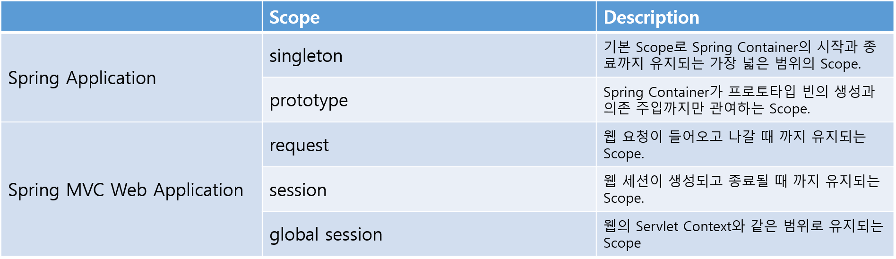

# Bean Scope

### **POJO란?**

---

<br>

> POJO란 Plain Old Java Object의 약자로 특정 기술에 종속되어 동작하는 것이 아닌 기본적이고 오래된 순수한 자바 객체를 의미한다.

### **Bean이란?**

---

<br>

> Bean은 Spring IoC(inversion of control) Container가 관리하는 POJO기반의 자바 객체를 의미한다. Bean은 Application의 핵심을 이루는 객체이며, 대부분 Container에 공급하는 설정 메타 데이터(XML 파일)에 의해 생성된다.

※ Container는 인스터스의 생명주기를 관리하며, 생성된 인스턴스들에게 추가적인 기능을 제공하는 것이다.
<br>
※ Spring IoC Container는 객체의 생성과 의존성을 관리한다.

<br>

### **Bean의 생성 방식**

<br>

1. application.xml 파일에서 클래스를 bean으로 등록

```
<bean id="bookService"
          class="com.ssafy.book.BookService">
</bean>
```

<br>

2. application.xml 파일에서 context:component-scan, 클래스에서 Annotation을 이용해 생성

```
<context:component-scan base-package="com.ssafy.book"/>
```

```
@Service
public class BookService {
    ...
}
```

<br>

3. ApplicationConfig.java 파일에서 생성

```
@Configuration
public class ApplicationConfig {

   @Bean
   public BookService bookService() {
       ...
   }

}
```

<br>

4. ApplicationConfig.java 파일에서 @ComponentScan 사용

```
@Configuration
@ComponentScan(basePackageClasses = SpringApplication.class) // 최상단 메인 클래스
public class ApplicationConfig {
    ...
}
```

※ @SpringBootApplication에는 @Configuration와 @ComponentScan가 내포되어 있다.

### **Bean Scope**

---

<br>



<br>

### 예상 질문

---

📌 POJO란 무엇인가요?

> POJO란 Plain Old Java Object의 약자로 특정 기술에 종속되어 동작하는 것이 아닌 기본적이고 오래된 순수한 자바 객체를 의미합니다.

📌 Bean이란 무엇인가요?

> Bean은 Spring IoC Container가 관리하는 POJO기반의 자바 객체를 의미합니다. Bean은 Application의 핵심을 이루는 객체이며, 대부분 Container에 공급하는 설정 메타 데이터(XML 파일)에 의해 생성됩니다.

📌 Bean Scope의 default값은 무엇인가요?

> singleton

 <br>

 <br>
