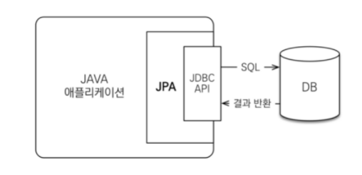
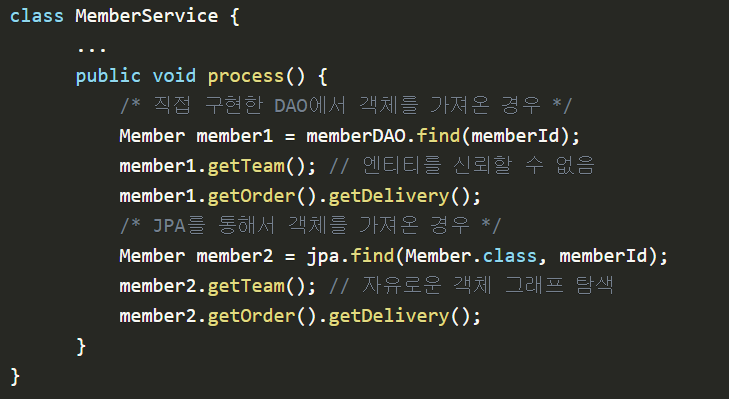

# JPA

**JPA는 자바 진영에서 ORM 기술 표준으로 사용되는 인터페이스의 모음**
 

**클래스와 매핑을 해주기 위해 사용되는 프레임워크**

- ORM: 객체 관계 매핑, 객체와 DB를 중간에서 매핑

- ex) Hibernate, EclipseLink, Datanucleus

 

## JPA 동작 과정

 

- JPA는 애플리케이션과 JDBC사이에서 동작
- 개발자가 JPA사용하면, JPA 내부에서 JDBC API를 사용하여 SQL을 호출해 DB와 통신
- 개발자가 직접 JDBC API를 쓰지 않음

 

## JPA를 왜 사용해야하는가

1. SQL 중심적인 개발에서 객체 중심 개발

2. 생산성

   - 간단한 CRUD
     - 저장: jpa.persist(member)
     - 조회: Member member = jpa.find(memberId)
     - 수정: member.setName("변경할 이름")
     - 삭제: jpa.remove(member)
   - 수정이 굉장히 간단함
     - 객체를 변경하면 알아서 DB에 UPDATE Query가 나감

3. 유지보수

   - 기존: 필드 변경시 모든 SQL 수정
   - JPA: 필드만 추가하면됨. SQL은 JPA가 처리

4. Object와 RDB간 패러다임 불일치 해결

 

- 내가 아닌 다른 개발자가 직접 구현한 DAO에서 가져오는 경우

  - DAO에서 직접 어떤 쿼리를 날렸는지 확인하지 않는 이상, 그래프 형태 관련된 객체를 모두 잘 가져왔는지 알수없음
  - 반환한 엔티티를 신뢰하고 사용할 수 없음

- JPA를 통해서 가져오는 경우
  - 객체 그래프를 완전히 자유롭게 탐색 가능
  - 지연 로딩 전략(Lazy Loading) 사용
    - 관련된 객체를 사용하는 그 시점에 SELECT Query를 날려 객체를 가져오는 전략

 
 

_지연로딩vs즉시로딩_

지연 로딩

- 객체가 실제로 사용될 때 로딩하는 전략
  - memberDAO.find(memberId)에서는 Member 객체에 대한 SELECT 쿼리만 날림
  - Team team = member.getTeam()로 Team 객체를 가져온 후에 team.getName()처럼 실제로 team 객체를 건드릴 때!

 
즉시 로딩

- JOIN SQL로 한번에 연관된 객체까지 미리 조회하는 전략
- Join을 통해 항상 연관된 모든 객체를 같이 가져옴
- N+1문제 발생
  - 엔티티를 조회할 경우에 조회된 데이터 갯수(n) 만큼 연관관계의 조회 쿼리가 추가로 발생하여 데이터를 읽어오게 된다.

---

참고

https://gmlwjd9405.github.io/2019/08/04/what-is-jpa.html
