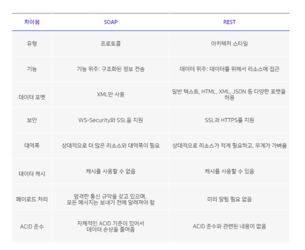
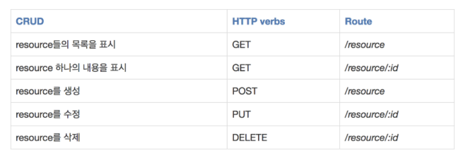

# REST API

## REST란

- 자원을 이름으로 구분하여 해당 자원의 상태를 주고 받는 모든 것을 의미함
- 월드와이드 웹과 같은 분산 하이퍼 미디어 시스템을 위한 소프트웨어 개발 아키텍처의 한 형식
   
   

## REST가 필요한 이유

- 애플리케이션 분리 및 통합
- 다양한 클라이언트의 등장

**-> 매번 서버를 새로 만드는 수고를 들이지 않기 위해 범용적인 사용성을 보장**

 
 

## SOAP VS REST

 

### SOAP

- 일반적으로 널리 알려진 HTTP,HTTPS,SMTP등을 통해 XML기반 메시지를 컴퓨터 네트워크 상에서 교환하는 프로
  토콜
- 웹 서비스에서 기본적인 메시지를 전달하는 기반
- 플랫폼에 독립적, 프로그래밍 언어에도 독립적
   

---

 

## REST API란

- REST라는 아키텍처를 구현하는 웹서비스를 나타내기 위한 용어
- HTTP URI를 통해 자원을 명시하고, HTTP METHOD를 통해 해당 자원에 대한 CRUD를 적용함
- 대부분의 OPEN API가 REST API를 지원함
   
   

 

## REST API 특징

- **Client-Server구조**
  - 클라이언트와 서버구조로 각각의 역할이 확실히 구분되므로 내용이 명확해지고 서로간 의존성이 줄어들게 됨

 

- **무상태성**
  - 상태정보를 따로 저장하고 관리하지 않아 들어오는 요청만을 단순히 처리하며, 서비스의 자유도 높아짐

 

- **Uniform**
  - URI로 지정한 리소스에 대한 조작을 통일되고 한정적인 인터페이스로 수행하는 아키텍처 스타일

 

- **캐시기능**

 
 

## REST API 기본규칙

- URI는 정보의 자원을 표현해야함
- Resource는 동사보다 명사를, 대문자보다는 소문자를 사용함
- Resource의 도큐먼트 이름으로는 단수 명사를 사용해야함
- Resource의 컬렉션 이름으로는 복수 명사를 사용해야함
- Resource의 스토어 이름으로는 복수 명사를 사용해야함
- 경로 부분 중 변하는 부분은 유일한 값으로 대체함

 
 

## REST API 설계 규칙

1. 슬래시 구분자(/)는 계층 관계를 나타내는데 사용

 

2. URI 마지막 문자로 슬래시(/)를 포함하지 않음
   - URI에 포함되는 모든 글자는 Resource의 유일한 식별자로 사용되어야하며 URI가 다르다는 것은 Resource
     가 다르다는 것이고, 역으로 Resource가 다르면 URI도 달라져야함
   - REST API는 분명한 URI를 만들어 통신을 해야하기 때문에 혼동을 주지 않도록 URI경로의 마지막에는 슬래시
     (/)를 사용하지 않음

 

3. 하이픈을 지향하고 밑줄은 사용하지 않음
   - 불가피하게 긴 URI경로를 사용하게 된다면 하이픈을 사용해 가독성을 높임
   - 밑줄은 보기 어렵거나 밑줄 때문에 문자가 가려지기도 하므로 가독성을 위해 밑줄은 사용하지 않음

 

4. URI경로에는 소문자가 적합함

 

5. 파일확장자는 URI에 포함하지 않음
   - REST API에서는 메시지 바디 내용의 포맷을 나타내기 위한 파일확장자를 URI안에 포함시키지 않음

 

6. Resource간에 연간관계가 있는 경우
   - /리소스명/리소스ID/관계가 있는 다른 리소스 명

 

 
 

## REST API VS HTTP API

- HTTP API와 REST API는 사실 거의 같은 의미로 사용됨
- HTTP API는 HTTP를 사용해서 서로 정해둔 스펙으로 데이터를 주고 받으며 통신하는 것
- REST API는 HTTP API에 여러가지 제약조건 추가

  - 자원의 식별
  - 메시지를 통한 리소스 조작
  - 자기서술적 메시지
  - 애플리케이션의 상태에 대한 엔진으로서 하이퍼미디어
