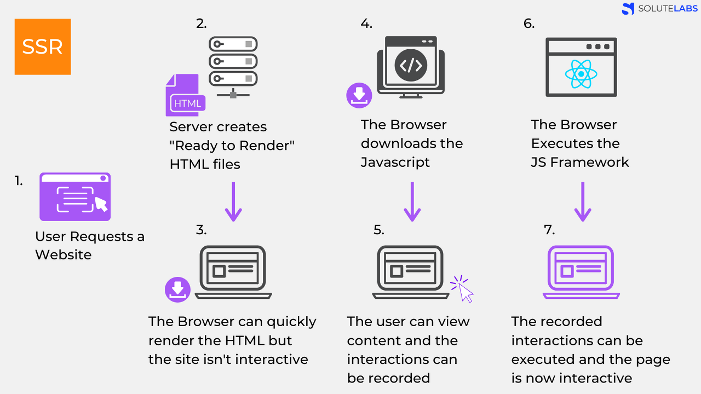
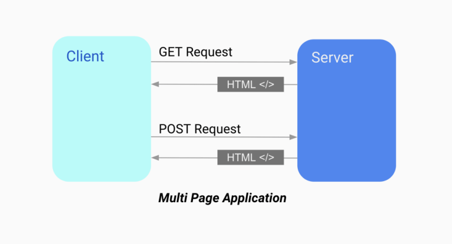
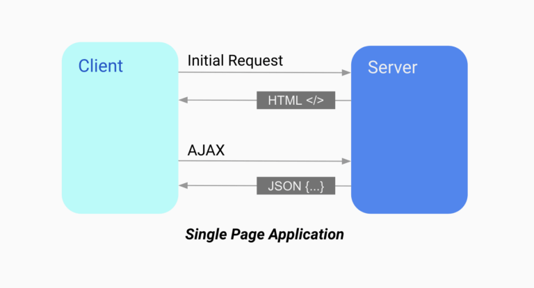
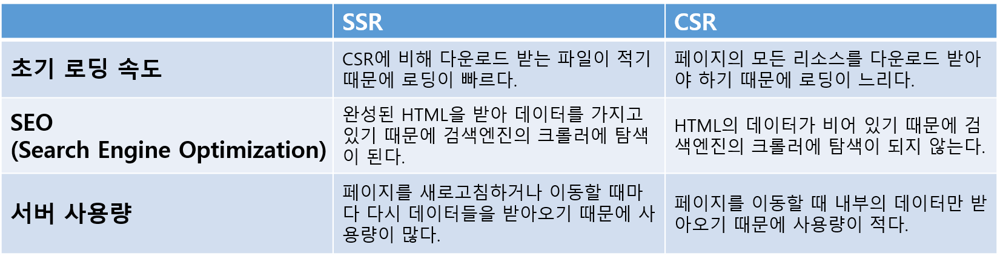

# SSR & CSR

### **SSR이란?**

---

> SSR은 Server Side Rendering의 약자로 서버측에서 렌더링을 모두 완료한 뒤 클라이언트에 데이터를 전달하는 방식을 의미한다.

<br>

#### **SSR의 진행과정**

<br>



```
1. 유저가 웹사이트에 요청을 보낸다.

2. 서버가 리소스 체크와 컴파일을 통해 즉시 렌더링이 가능한 완성된 HTML파일들을 생성한다 .

3. 브라우저가 완성된 HTML파일을 다운로드 받는다. HTML파일이 이미 렌더링이 완료되어있는 상태이기 때문에 즉시 렌더링이 되지만, JavaScript가 렌더링되지 않았기 때문에 아직 페이지와의 상호작용은 불가능하다.

4. JavaScript를 다운로드받는다.

5. 다운로드를 받는 동안 유저는 컨텐츠들을 볼 수 있지만, 조작은 불가능 하기 때문에 사용자의 상호작용 시도들을 기억해 놓는다.

6. JavaScrpit 프레임워크를 실행한다.

7. 이 단계부터 페이지와 상호작용이 가능해지고, 5단계에서 기억해놓는 사용자의 조작이 실행된다.

```

<br>

### **MPA**

---

<br>


<br>

여러 개의 싱글 페이지로 구성된 애플리케이션으로, 새로운 페이지를 요청할 때 마다 서버에서 렌더링된 데이터들(HTML, CSS, JavaScript)이 다운로드 된다. 페이지를 이동하거나 새로고침하면 전체 페이지를 다시 렌더링한다.

<br>

### **CSR이란?**

---

> CSR은 Client Side Rendering의 약자로 서버로부터 전달받은 데이터를 클라이언트 측에서 직접 렌더링 하는 방식을 의미한다.

<br>

#### **CSR의 진행 과정**

<br>


 <br>

```
1. 유저가 웹 사이트에 요청을 보낸다.

2. CDN이 서버의 데이터들(HTML, JavaScript 등)에 접근할 수 있는 링크를 클라이언트에 보낸다.

3,4. 해당 링크를 통해 HTML과 JavaScript를 다운로드 받는다. 이 단계에서는 다운로드만 받은 상태이므로 브라우저의 화면에는 아무것도 보이지 않는다.

5. 다운로드가 완료된 JavaScript가 실행되고, API를 호출한다. 이 단계에서 브라우저 화면에는 데이터가 들어 있지 않은 빈 placeholder들이 표시된다.

6. 서버가 API의 호출에 응답해 데이터를 보낸다.

7. API에서 받아온 데이터들을 placeholder 자리에 넣어준다. 이 단계부터 페이지와 상호작용이 가능해진다.
```

※ CDN이란?

> Content Delivery Network의 약자로 특정 서버에 트래픽이 집중 되지않고, 컨텐츠를 자동으로 가장 가까운 서버에서 다운받도록 하는 기술을 의미한다.

<br>

### **SPA**

---

<br>


<br>

한 개의 단일 페이지로 구성된 애플리케이션으로, 최초 실행 시 서버에서 데이터(HTML, CSS, JavaScript)들을 다운로드 받는다. 페이지를 이동할 때 페이지를 다시 렌더링하지 않고 페이지의 내부를 수정해서 보여준다.

<br>

### CSR과 SSR의 장단점

---

<br>



<br>

### 예상 질문

---

📌 CSR이 SSR보다 유리한 점이 무엇이 있을까요?

> 페이지 간의 이동 시 화면 깜빡임이 없기 때문에 사용자의 편리성 측면에서 보다 유리하고, 또한 페이지 내부의 데이터만 서버에 요청하면 되기 때문에 서버 자원을 덜 사용한다는 장점이 있습니다.

📌 CSR을 사용하면서 동시에 SEO까지 챙길 수 있는 방법은 없을까요?

> title 태그와 meta 태그에 검색엔진에 노출시키고 싶은 정보들을 삽입하는 방법이 있지만, SSR보다 매끄럽지 않기 때문에 SEO가 필요할 경우 SSR 방식을 쓰는 편이 더 효율적입니다.

 <br>

 <br>
